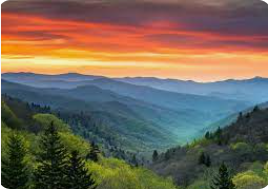
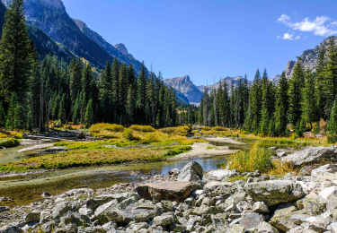
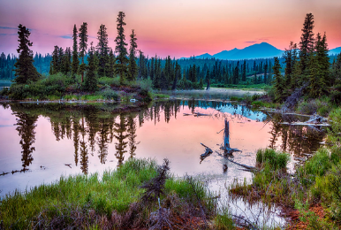

# Travel-Site-RileyLukach
<!DOCTYPE html>
<html>
  <h2>National Parks in the United States</h2>
  <h4>Great Smoky Mountains National Park</h4>

The Great Smoky Mountains National Park is located on the border of North Carolina and Tennessee. This amazing National Park covers 522,427 acres of land and is divided almost evenly between the two states. There is no entrance fee to get into this park but you do have to pay for parking if you are staying for more than 15 minutes. You should plan and pack emergency essentials in case of emergency. (If you click on the photo you can find more information about different activities you can do at the park.)

<h4>Grand Teton National Park</h4>

This beautiful national park is located in Wyoming. This park contains 200 miles of trails and has many more amazing features. You can floast down the Snake River or explore the mountains. The busiest time of year is in May because people want to enjoy the nice weather with the many lakes located in the park. The laregest lake is Jackson Lake. Hiking, camping and fishing are the most popular activities to do in the park. There is even a large amount of wildlife throughout the park that you may come across. (Click on the picture to find out more information on Grand Teton National Park.)

<h4>Wrangell–St. Elias National Park</h4>

Wrangell-St. Elias National Park is the largest national park in the United States and is located in Alaska. This park is the largest park by land and it is 13.2 million acres. Four Alaska native groups call Wrangell-St. Elias their home. Guided tours are offered too during the summer by park rangers. There are a variety of activities you can do in the park. Some of the activities are backpacking, mountaineering, floating, boating, hunting, fishing, wildlife viewing, motorized vehicles, and many other winter activities.<em>(Click on the picture to learn more about the different areas and roads in the park)</em>>

